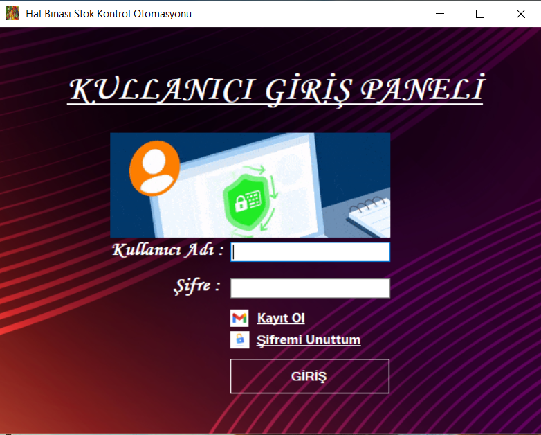

# Hal_Binasi_Manav_Otomasyonu

Bu proje, hal binası gibi pazarlarda ürünlerin kasa ile satış, stok kontrolü ve kullanıcı yönetimi gibi iş süreçlerini kolaylaştırmak için geliştirilmiş bir masaüstü otomasyon yazılımıdır.

2023 yılında yapmış olduğum bir projedir.

## 📸 Ekran Görüntüleri

### 🔐 Giriş Ekranı

### 🏠 Ana Ekran

### 🛒 Satış Paneli (1)

### 🧾 Fatura Ekranı

### 📑 Raporlar

### 📊 Ürün Grafik Görünümü

### 💰 Kasa Analizi

## 🧪 Kurulum

- `Setup/setup.exe` dosyasını çalıştırarak uygulamayı doğrudan yükleyebilirsiniz.
- Bu kurulum, LocalDB ile çalışır (aşağıdaki kurulumlara gerek yoktur,sadeve visual studio da yapamnız gerekn adımmlar sırası).

## 🚀 Özellikler

- Ürün giriş/çıkış takibi
- Firma ve müşteri yönetimi
- Kullanıcı yetkilendirme
- Canlı grafiklerle stok analizleri (LiveCharts)
- SQL Server ile entegre veritabanı
- Kullanıcı dostu Windows Forms arayüzü

---

## 🛠️ Kullanılan Teknolojiler

- **C# / .NET Framework**
- **Windows Forms**
- **MSSQL Server** (Data.mdf - LocalDB)
- **ADO.NET**
- **LiveCharts (grafik için)**
- **ClickOnce (kolay kurulum için)**

---

## 🧩 Kurulum Talimatları

### 1. Gereksinimler

- Visual Studio 2019 veya 2022
- .NET Framework 4.x yüklü olmalı
- SQL Server Express veya LocalDB
- Crystal Reports (Eğer rapor modülü varsa)
- LiveCharts NuGet üzerinden kurulmalı
  

### 2. Veritabanı Kurulumu

- `Setup/Application Files/.../Data.mdf` ve `Data_log.ldf` dosyalarını kullanarak SQL Server'da bir veritabanı oluşturun.
- `App.config` dosyasındaki bağlantı cümlesini (connection string) kendi SQL Server ortamınıza göre güncelleyin.

### 3. Projeyi Çalıştırma

- `Hal Binası Stok Kontrol.sln` dosyasını Visual Studio ile açın.
- Gerekirse NuGet paketlerini geri yükleyin (`Tools > NuGet Package Manager > Restore Packages`).
- `F5` tuşuna basarak çalıştırın.

---

